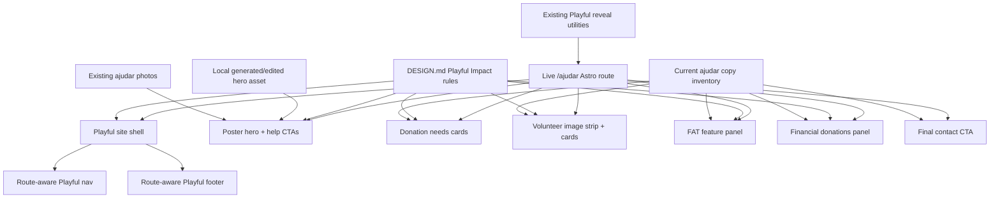

# feat: Redesign Ajudar page with Playful Impact

## Summary

Redesign the live `/ajudar` page directly in CAPA's Playful Impact direction while preserving every existing help, donation, volunteer, FAT, payment, email, and CTA copy point.

The plan improves the hero into a poster-like first viewport with a local AI-generated or AI-edited hero asset, keeps a real-photo fallback, and verifies the live route before reporting the redesign complete.

---

## Problem Frame

`/ajudar` is currently a static Astro page with the older warm-earth styling and a text-only dark-gradient hero. The rest of the page has useful content, real help paths, and existing shelter imagery, but the visual treatment does not match the new Playful Impact direction already documented in `DESIGN.md` and proven on `/test-landing`.

The user wants the new direction applied to the live help page without a staging route, without removing copy, and with special attention on making the hero feel much stronger.

---

## Requirements

**Route and content preservation**

- R1. Redesign the existing live `/ajudar` route directly; do not create a separate test page for this work.
- R2. Preserve all current visible copy, including hero paragraphs, donation item names, volunteer opportunities, FAT explanation, payment guidance, IBAN, email links, and final CTA copy.
- R3. Preserve the page's practical conversion paths: email contact, FAT email subject, donation details, MB Way/PayPal guidance, and navigation to existing public routes.

**Playful Impact design**

- R4. Apply the Playful Impact system from `DESIGN.md`: cream canvas, Sora/Plus Jakarta Sans, juicy orange actions, peach/watermelon accents, organic image crops, pillowy cards, soft-brutalist rotations, and squishy interactions.
- R5. Rework the hero into a high-impact poster composition with one dominant dog/help visual, strong headline hierarchy, floating badges, and clear above-the-fold contact/help actions.
- R6. Use real or realistic animal-rescue imagery; support an AI-generated or AI-edited hero asset only if it feels credible, has no embedded text, and has a local real-photo fallback.

**Accessibility and motion**

- R7. Keep semantic landmarks, heading order, focus states, touch targets, image alt text, and readable color contrast.
- R8. Add route-scoped scroll reveal and tactile hover motion that respects `prefers-reduced-motion` and never leaves content hidden.
- R9. Keep mobile layouts readable, especially the IBAN/payment block and dense donation lists.

**Operational safety**

- R10. Keep Playful styling additive and scoped so unrelated live routes do not visually regress.
- R11. Update metadata to the current `capapvl.org` surface and use the final hero asset as the page's share image when suitable.
- R12. Build, visually verify desktop/mobile, deploy to Hetzner, verify live `/ajudar`, and record the change in `CHANGELOG.md`.

---

## Key Technical Decisions

- **Direct live route with stronger pre-deploy QA:** Because the user explicitly rejected a test page, the plan changes `/ajudar` itself but requires local build, preview screenshots, content checks, and live verification before completion.
- **Copy inventory before redesign:** Preserve the existing page text by moving repeated content into section data structures or components before restyling, so the redesign changes presentation rather than silently rewriting donation/help content.
- **Route-specific Astro components:** Break the current long page into static Astro sections under `src/components/ajudar/` so the hero, donation needs, volunteer, FAT, financial donation, and final CTA areas can be redesigned independently while keeping the page simple and static.
- **AI hero asset with fallback:** Plan for one generated or AI-edited local hero asset under `public/images/ajudar/`, but fall back to existing CAPA imagery if generation is unavailable, too artificial, or inconsistent with the rescue tone.
- **No new animation dependency:** Reuse the CSS and IntersectionObserver reveal approach from `/test-landing`; the existing stack does not need Framer Motion or another runtime library for this page.
- **Real-site navigation, not test anchors:** Do not reuse the `/test-landing` nav/footer verbatim because those components point at section anchors and the test route. Use route-aware Playful site chrome or adapt the pattern to real `/`, `/caes`, `/sobre-nos`, `/ajudar`, and language paths.

---

## High-Level Technical Design

---

## Implementation Units

### U1. Establish the live Playful Ajudar shell

- **Goal:** Convert `/ajudar` into a Playful Impact page shell without changing route behavior or existing site navigation targets.
- **Requirements:** R1, R4, R7, R10, R11
- **Dependencies:** none
- **Files:**
  - `src/pages/ajudar.astro`
  - `src/components/playful/PlayfulSiteNav.astro`
  - `src/components/playful/PlayfulSiteFooter.astro`
  - `src/styles/global.css`
- **Approach:** Use `Layout` with `playfulFonts`, wrap the page in a route-scoped Playful container, and create route-aware Playful nav/footer components that adapt the visual language from `/test-landing` without copying its anchor-only behavior. Keep global CSS additions additive and prefixed to Playful helpers.
- **Patterns to follow:** `src/pages/test-landing.astro`, `src/components/test-landing/PlayfulNav.astro`, `src/components/test-landing/PlayfulFooter.astro`, `src/layouts/Layout.astro`, `src/styles/global.css`
- **Test scenarios:**
  - Navigate to `/ajudar` and verify the page still uses the Portuguese help route rather than a new review route.
  - Click desktop and mobile nav links for home, dogs, about, and help; each should target the existing public routes rather than `#` anchors from `/test-landing`.
  - Use the language switcher on `/ajudar`; it should keep the existing alternate path behavior and not point users to `/test-landing`.
  - Inspect focus-visible states on nav, language, CTA, and footer links; keyboard users should see a visible Playful focus ring.
- **Verification:** The built `/ajudar/index.html` contains the Playful shell, current `capapvl.org` metadata, and no `/test-landing` nav leakage.

### U2. Create and integrate the hero visual system

- **Goal:** Replace the current text-only dark hero with a Playful poster hero centered on helping CAPA.
- **Requirements:** R2, R3, R4, R5, R6, R7, R11
- **Dependencies:** U1
- **Files:**
  - `src/components/ajudar/AjudarPlayfulHero.astro`
  - `public/images/ajudar/hero-playful-help.webp`
  - `public/images/ajudar/hero-playful-help-fallback.jpg`
  - `src/pages/ajudar.astro`
- **Approach:** Preserve the existing hero badge, headline, and two paragraphs, but restage them with large Sora hierarchy, orange underline/sticker accents, two clear help CTAs, and a dominant organic photo/blob. Generate or AI-edit one hero asset that suggests practical shelter help without embedded text; if it does not pass visual QA, use a curated existing CAPA image such as the happy dog, fostering, or close-up asset.
- **Patterns to follow:** `src/components/test-landing/PlayfulHero.astro`, `DESIGN.md` hero guidance, current `/ajudar` hero copy in `src/pages/ajudar.astro`, existing image assets under `public/images/ajudar/`
- **Test scenarios:**
  - Verify the existing hero strings still appear exactly once in the rendered page.
  - Verify the hero image loads with `fetchpriority="high"`, meaningful Portuguese alt text, and no embedded text inside the image.
  - Simulate hero asset failure by switching to the fallback path during implementation review; the layout should remain visually usable.
  - Check desktop and mobile screenshots; the hero should have one dominant visual anchor and no cropped-away dog face or unreadable overlay text.
- **Verification:** The hero is visibly stronger than the current dark gradient, the image asset is local, and social preview metadata uses the final asset only if it crops safely.

### U3. Redesign donation needs and volunteer support sections

- **Goal:** Convert the in-kind donation and volunteer areas into tactile Playful sections without losing dense practical information.
- **Requirements:** R2, R3, R4, R7, R8, R9, R10
- **Dependencies:** U1
- **Files:**
  - `src/components/ajudar/AjudarDonationNeeds.astro`
  - `src/components/ajudar/AjudarVolunteerWays.astro`
  - `src/pages/ajudar.astro`
  - `src/styles/global.css`
- **Approach:** Keep the four donation categories and four volunteer opportunities, but restyle them as pillowy cards with warm borders, readable list rhythm, small rotations, icon badges, and staggered reveal. Preserve the current volunteer photo strip, using organic crops and hand-placed overlap instead of a flat grid.
- **Patterns to follow:** `src/components/test-landing/PlayfulHelpCta.astro`, `src/components/test-landing/PlayfulStats.astro`, current donation and volunteer markup in `src/pages/ajudar.astro`
- **Test scenarios:**
  - Verify each donation category remains present with all current list items.
  - Verify the delivery contact sentence and `capa.geralpvl@gmail.com` mail link remain present.
  - Verify Passear os Cães, Fotografar Animais, Voluntariado no Abrigo, and Campanhas e Divulgação remain present with their current descriptions.
  - At mobile width, check that donation list cards do not force horizontal scrolling and images do not become too small to read.
  - With reduced motion enabled, verify every card appears immediately without hidden opacity or blur.
- **Verification:** The section reads as a practical help checklist while matching the Playful Impact rhythm and motion.

### U4. Redesign FAT and financial donation conversion panels

- **Goal:** Make the highest-intent help paths easier to scan and act on while preserving all payment and foster-family details.
- **Requirements:** R2, R3, R4, R7, R8, R9, R10
- **Dependencies:** U1
- **Files:**
  - `src/components/ajudar/AjudarFosterFamilies.astro`
  - `src/components/ajudar/AjudarFinancialDonations.astro`
  - `src/pages/ajudar.astro`
- **Approach:** Turn FAT into a large warm feature panel with the existing foster explanation, dog-fostering image, stats, and FAT mailto CTA. Turn financial donations into a high-contrast donation card system that keeps bank transfer, IBAN, MB Way, PayPal, and payment-question copy visible without mobile overflow.
- **Patterns to follow:** `src/components/test-landing/PlayfulAboutBlurb.astro`, `src/components/test-landing/PlayfulHelpCta.astro`, current FAT and financial sections in `src/pages/ajudar.astro`
- **Test scenarios:**
  - Verify every FAT paragraph remains present, including the `+100 animais` sentence and CAPA support promise.
  - Click the FAT CTA and confirm the mailto subject remains `Quero ser FAT`.
  - Verify the IBAN remains `PT50 0010 0000 4591 4000 0014 9` in the financial donation section.
  - At mobile width, verify the IBAN wraps or scales without clipping and remains selectable/readable.
  - Verify MB Way and PayPal guidance remains present and visually secondary to the bank-transfer block.
- **Verification:** Users can understand how to foster or donate within a few seconds, and payment details remain practical rather than decorative.

### U5. Add route-scoped reveal motion and final CTA polish

- **Goal:** Give `/ajudar` the same alive-on-scroll feeling as `/test-landing` without compromising accessibility.
- **Requirements:** R4, R7, R8, R9, R10
- **Dependencies:** U1, U2, U3, U4
- **Files:**
  - `src/pages/ajudar.astro`
  - `src/components/ajudar/AjudarFinalCta.astro`
  - `src/styles/global.css`
- **Approach:** Reuse the existing `data-playful-scroll-reveal` pattern, reveal utilities, and reduced-motion fallbacks. Stage the hero on load, reveal section headers/cards as they enter the viewport, and polish the final CTA as a warm Playful close rather than another dark-gradient block.
- **Patterns to follow:** Scroll reveal script in `src/pages/test-landing.astro`, reveal attributes in `src/components/test-landing/*`, current final CTA copy in `src/pages/ajudar.astro`
- **Test scenarios:**
  - Scroll through the full page on desktop and verify all reveal-marked elements become visible by the bottom of the page.
  - Scroll through the full page on mobile and verify no section remains blurred, transparent, or shifted off-screen.
  - Enable `prefers-reduced-motion: reduce`; all content should render statically and immediately.
  - Verify the final CTA preserves `Cada Gesto Conta`, both current paragraphs, and `Fale Connosco` mailto behavior.
- **Verification:** Automated DOM inspection or manual browser inspection reports zero stuck reveal elements after full-page scroll.

### U6. Verify, deploy, and document the live page change

- **Goal:** Prove the direct live redesign is safe, publish it, and record what changed.
- **Requirements:** R1, R2, R8, R9, R10, R11, R12
- **Dependencies:** U1, U2, U3, U4, U5
- **Files:**
  - `scripts/verify-ajudar-content.mjs`
  - `CHANGELOG.md`
- **Approach:** Add a lightweight content smoke script that checks the built `/ajudar` HTML for the preserved high-risk strings, Playful root, hero image path, and current metadata. Build with the production API URL and asset version, preview locally, capture desktop/mobile screenshots, deploy static output to Hetzner, then verify live `/ajudar`, root route, image assets, and headers.
- **Patterns to follow:** Deploy guidance in `AGENTS.md`, screenshot/verification approach used for `/test-landing`, changelog style in `CHANGELOG.md`
- **Test scenarios:**
  - Run the content smoke against built HTML; it should fail if any key copy, IBAN, or email link disappears.
  - Verify local `/ajudar/` returns 200 and is not the 404 body.
  - Verify desktop and mobile screenshots show no horizontal overflow, missing images, clipped hero, or unreadable payment details.
  - Verify live `https://capapvl.org/ajudar/` returns 200 after deploy and references the new built asset version.
  - Verify live `/` still returns 200 and does not unexpectedly adopt the `/ajudar` page styling.
- **Verification:** The final report includes build output, local screenshot paths, live HTTP checks, and the changelog diff.

---

## Acceptance Examples

- AE1. A desktop visitor opening `/ajudar` sees a warm Playful hero with the current “Faça a Diferença” / “Apoie o CAPA PVL!” message, a dominant dog/help visual, and clear paths to contact or help.
- AE2. A mobile visitor scrolling to financial donations can read and copy the IBAN without horizontal scrolling or clipped text.
- AE3. A potential FAT volunteer can still read the full FAT explanation and use the existing `Quero ser FAT` email CTA.
- AE4. A reduced-motion visitor sees all content immediately, with no hidden reveal state.
- AE5. If the AI-generated hero image is rejected or unavailable, `/ajudar` still ships with a credible existing CAPA photo fallback and no broken image slot.

---

## Scope Boundaries

### In scope

- Live Portuguese `/ajudar` redesign.
- Local hero image generation or AI edit path, plus fallback.
- Route-aware Playful nav/footer treatment for `/ajudar`.
- Scroll reveal and tactile interaction polish.
- Build, local visual QA, live deploy, live verification, and changelog update.

### Deferred to Follow-Up Work

- Applying Playful Impact to `/`, `/adocao`, `/sobre-nos`, `/caes`, or dog profiles.
- English `/en/help` visual parity.
- Replacing the existing `/test-landing` implementation with shared production components.
- Adding a full browser test suite beyond the lightweight content smoke.

### Outside this change

- Copy strategy rewrites.
- CAPA dog data, API, admin, or database changes.
- Payment provider integration or online checkout.
- Any new public route for review or staging.

---

## System-Wide Impact

The intended visual impact is localized to `/ajudar`, but the plan may add shared Playful site chrome under `src/components/playful/` and shared CSS helpers under `src/styles/global.css`. Those additions must be additive, route-scoped in usage, and safe for the existing live homepage, dog listings, admin, and adoption pages.

The page is live and indexable, so metadata should use `capapvl.org` rather than the older `capapvl.pt` URL still present in the current page.

---

## Risks & Dependencies

| Risk | Mitigation |
|---|---|
| AI hero looks fake, sentimental, or off-brand | Treat generation as optional; require visual QA and use existing CAPA imagery as fallback. |
| Existing copy gets lost during component extraction | Create a content smoke script and compare key strings before deploy. |
| Direct live route introduces production regression | Build, preview, screenshot, deploy, and live-smoke `/ajudar` plus `/` before final report. |
| Test-landing nav/footer copied too literally | Use route-aware Playful site chrome instead of anchor-only test components. |
| Motion leaves content hidden | Reuse the proven reveal script and verify all reveal elements become visible after full scroll. |
| IBAN overflows mobile | Design financial cards around wrapping/selectable payment text and verify at narrow widths. |
| Tailwind misses dynamic classes | Use explicit class maps for rotations, colors, reveal types, and card variants. |

---

## Sources / Research

- Project constraints and deploy workflow: `AGENTS.md`
- Current design direction: `DESIGN.md`
- Current live help page: `src/pages/ajudar.astro`
- Current layout font support: `src/layouts/Layout.astro`
- Playful route shell and reveal script: `src/pages/test-landing.astro`
- Playful hero, help CTA, nav, and footer patterns: `src/components/test-landing/PlayfulHero.astro`, `src/components/test-landing/PlayfulHelpCta.astro`, `src/components/test-landing/PlayfulNav.astro`, `src/components/test-landing/PlayfulFooter.astro`
- Playful tokens and reveal utilities: `src/styles/global.css`
- Existing help-page images: `public/images/ajudar/`
- Existing test landing plan: `docs/plans/2026-06-21-001-feat-test-landing-playful-impact-plan.md`
- Package stack: `package.json`
- Visual reference: attached Playful Impact screenshot in the user thread

External web research was skipped because the repo already contains the target design system, implementation pattern, asset set, and deployment workflow. The exact image-generation backend is an implementation-time availability check; the plan keeps a local fallback so the redesign does not depend on a specific generator.
