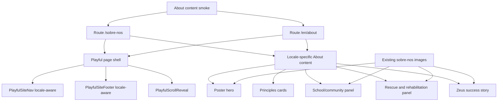

# feat: Redesign Sobre Nos pages with Playful Impact

## Summary

Redesign the live Portuguese `/sobre-nos` page and English `/en/about` page with CAPA's Playful Impact system, preserving all current copy in both locales.

The plan focuses on a much stronger hero, bilingual parity, real CAPA imagery, route-scoped motion, and verification that both public routes remain indexable, readable, and safe to deploy directly.

---

## Problem Frame

`/sobre-nos` and `/en/about` already contain the right story: CAPA's origin, volunteer-run care, principles, community school work, rescue/rehabilitation, and Zeus success story. The current presentation still uses the older warm-earth design and a conventional dark-gradient hero, so the page feels more like a static information page than the tactile rescue-poster direction now established in `DESIGN.md`, `/test-landing`, and `/ajudar`.

The user wants the redesign applied directly to the live About pages, without a separate test route, without removing copy, and with special attention on making the hero substantially better.

---

## Requirements

**Route and copy preservation**

- R1. Redesign the existing live `/sobre-nos` route directly; do not create a separate test or review page.
- R2. Include English `/en/about` parity in the same plan so the language switcher does not send users to a visually legacy About page.
- R3. Preserve all current visible Portuguese and English copy, including hero text, principles, community/school partnership text, rescue and rehabilitation paragraphs, triage/reabilitation/adoption pills, Zeus caption, quote, and final dogs CTA.
- R4. Preserve route behavior and conversion paths, including `/caes`, `/en/dogs`, `mailto:capa.geralpvl@gmail.com`, and locale alternate paths.

**Playful Impact design**

- R5. Apply the Playful Impact system from `DESIGN.md`: cream canvas, Sora/Plus Jakarta Sans, high-contrast orange actions, peach/watermelon accents, real dog photography, pillowy cards, organic shapes, soft-brutalist rotations, and squishy interactions.
- R6. Rebuild the hero as a poster-like first viewport with stronger headline hierarchy, a dominant real CAPA dog/volunteer image, floating trust badges, and clear routes into dogs/help/contact actions.
- R7. Use real CAPA/shelter photography by default; generate only resized/local derivatives needed for responsive hero crops and Open Graph safety.
- R8. Keep the About story rhythm varied: open poster hero, tactile principles, a larger community feature panel, rescue/rehabilitation proof, and a warm success-story close.

**Accessibility, motion, and responsive behavior**

- R9. Maintain semantic landmarks, unique section headings, meaningful image alt text in both locales, visible focus states, touch targets, and WCAG AA contrast for interactive text.
- R10. Use route-scoped reveal motion through the shared `PlayfulScrollReveal` component, with no content hidden for reduced-motion users or script failures.
- R11. Keep mobile layouts single-column and overflow-safe, especially around rotated cards, floating hero badges, image collages, and final CTA buttons.

**Operational safety**

- R12. Keep Playful styling additive and scoped to the redesigned About routes so unrelated pages do not regress.
- R13. Keep both About routes indexable; do not copy `noindex` behavior from `/test-landing`.
- R14. Build, preview, screenshot-check desktop/mobile for both locales, deploy to Hetzner, verify live `/sobre-nos` and `/en/about`, and update `CHANGELOG.md`.

---

## Key Technical Decisions

- **Bilingual parity in one implementation pass:** The user chose to include `/en/about`; this avoids a polished Portuguese page sending language-switch users into a legacy English counterpart.
- **Locale-aware About components over duplicated markup:** Use shared static Astro components under `src/components/sobre-nos/` with locale-specific content maps where practical, so Portuguese and English stay visually identical while preserving each locale's existing text.
- **Use shared Playful chrome:** Reuse `PlayfulSiteNav`, `PlayfulSiteFooter`, and `PlayfulScrollReveal` for both routes instead of reintroducing legacy `Nav`, `Footer`, or copy-pasted reveal scripts.
- **Real-photo hero by default:** The strongest current hero candidates are `dog-recovery.jpg` for human-care emotion and `dogs-playing.jpg` for happy dog energy; derive local hero WebP/JPEG crops from one of these rather than using artificial imagery.
- **Do not restyle global `Stats` in place:** The current `Stats` component is shared with other pages. Add a Playful About-specific stats/proof block or locale-aware About section instead of changing global behavior and risking homepage regressions.
- **Content smoke before deploy:** Add an About-specific smoke script for both built routes because preserving bilingual copy is the highest-risk requirement in a visual rewrite.

---

## High-Level Technical Design

---

## Scope Boundaries

### In scope

- Direct redesign of `/sobre-nos` and `/en/about`.
- All current Portuguese and English About-page copy preserved.
- New About-specific Playful section components and responsive hero image derivatives.
- Local preview and live production verification for both locale routes.

### Out of scope

- Rewriting About-page copy or changing CAPA's story strategy.
- Replacing the homepage, dogs, adoption, admin, or help page content.
- Adding new backend/API behavior.
- Creating another noindex test route.

### Deferred to Follow-Up Work

- Converting every older warm-earth page to Playful Impact.
- Deep image optimization for every legacy PNG on the site beyond what is needed for the About hero and immediate visual QA.
- Fully unifying legacy and Playful nav/footer components across the entire site.

---

## Implementation Units

### U1. Establish bilingual Playful About shell

- **Goal:** Move `/sobre-nos` and `/en/about` onto the Playful page shell while keeping their existing routes and metadata behavior.
- **Requirements:** R1, R2, R4, R5, R9, R12, R13
- **Dependencies:** none
- **Files:**
  - `src/pages/sobre-nos.astro`
  - `src/pages/en/about.astro`
  - `src/components/playful/PlayfulSiteNav.astro`
  - `src/components/playful/PlayfulSiteFooter.astro`
  - `src/components/playful/PlayfulScrollReveal.astro`
  - `src/styles/global.css`
- **Approach:** Use `Layout` with `playfulFonts`, wrap both pages in a `data-playful-scroll-reveal` Playful container, and swap legacy `Nav`/`Footer` for route-aware Playful chrome. Keep both pages indexable and keep Open Graph URLs on `capapvl.org`.
- **Patterns to follow:** `src/pages/ajudar.astro`, `src/pages/test-landing.astro`, `src/components/playful/PlayfulSiteNav.astro`, `src/components/playful/PlayfulSiteFooter.astro`, `src/components/playful/PlayfulScrollReveal.astro`
- **Test scenarios:**
  - Open `/sobre-nos` and `/en/about`; both should render the Playful shell on their original route paths.
  - Use the language switcher from `/sobre-nos`; it should target `/en/about`, and switching back should target `/sobre-nos`.
  - Click desktop and mobile nav links; they should target live public routes, not `/test-landing` anchors.
  - Inspect both built HTML files; neither should contain `noindex`.
- **Verification:** Both built About routes include Playful fonts/chrome, current canonical `capapvl.org` metadata, and no test-route leakage.

### U2. Create locale-aware About content components

- **Goal:** Preserve all existing copy while making the bilingual redesign maintainable.
- **Requirements:** R2, R3, R4, R8, R9
- **Dependencies:** U1
- **Files:**
  - `src/components/sobre-nos/SobreNosPlayfulPage.astro`
  - `src/components/sobre-nos/SobreNosPlayfulHero.astro`
  - `src/components/sobre-nos/SobreNosPrinciples.astro`
  - `src/components/sobre-nos/SobreNosCommunity.astro`
  - `src/components/sobre-nos/SobreNosRescue.astro`
  - `src/components/sobre-nos/SobreNosSuccessStory.astro`
  - `src/pages/sobre-nos.astro`
  - `src/pages/en/about.astro`
- **Approach:** Move the current visible Portuguese and English About copy into locale-aware component data or props, preserving text exactly unless a markup split is needed for emphasis. Keep section IDs/headings unique and use each route page as a thin locale wrapper.
- **Patterns to follow:** Current `src/pages/sobre-nos.astro`, current `src/pages/en/about.astro`, locale prop handling in `src/components/playful/PlayfulSiteNav.astro`, static section-component split from `src/components/ajudar/*`
- **Test scenarios:**
  - Compare rendered text for Portuguese before and after; every current paragraph, card title, pill label, caption, quote, and CTA should remain present.
  - Compare rendered text for English before and after; every current translated string should remain present.
  - Verify `mailto:capa.geralpvl@gmail.com`, `/caes`, and `/en/dogs` links remain correct.
  - Verify all content images have locale-appropriate alt text.
- **Verification:** The pages are thin route wrappers and the content inventory can be smoke-tested without manually diffing long Astro files.

### U3. Rebuild the About hero as a Playful poster

- **Goal:** Replace the current dark-gradient hero with a high-impact Playful hero that immediately communicates CAPA's volunteer-run rescue work.
- **Requirements:** R3, R5, R6, R7, R9, R10, R11, R13
- **Dependencies:** U1, U2
- **Files:**
  - `src/components/sobre-nos/SobreNosPlayfulHero.astro`
  - `public/images/sobre-nos/hero-playful-about.webp`
  - `public/images/sobre-nos/hero-playful-about-fallback.jpg`
  - `src/pages/sobre-nos.astro`
  - `src/pages/en/about.astro`
- **Approach:** Preserve the existing hero badge/headline/paragraphs in both locales, but restage them with large Sora type, a cream poster canvas, floating badges such as founding year and volunteer/community proof, and one dominant organic hero photo. Use `dog-recovery.jpg` if the focus is care/volunteers, or `dogs-playing.jpg` if the focus is hopeful dog energy; avoid `community-event.png` as the hero because its narrow crop and cage bars are riskier above the fold.
- **Patterns to follow:** `src/components/ajudar/AjudarPlayfulHero.astro`, `src/components/test-landing/PlayfulHero.astro`, hero guidance in `DESIGN.md`
- **Test scenarios:**
  - Verify Portuguese hero strings `Fundados em 2001`, `Sobre o CAPA`, and both current hero paragraphs remain visible.
  - Verify English hero strings `Founded in 2001`, `About CAPA`, and both current hero paragraphs remain visible.
  - Verify the hero image loads locally, has dimensions set, uses `loading="eager"` and `fetchpriority="high"`, and has no white box behind it.
  - Capture mobile and desktop hero screenshots; the dog face and primary message should not be cropped or obscured by badges.
- **Verification:** The first viewport reads like a Playful Impact rescue poster rather than a legacy dark-gradient information hero.

### U4. Restyle principles, stats/proof, and community sections

- **Goal:** Make the mid-page story tactile and scannable while preserving the mission and school/community copy.
- **Requirements:** R3, R5, R8, R9, R10, R11, R12
- **Dependencies:** U1, U2
- **Files:**
  - `src/components/sobre-nos/SobreNosPrinciples.astro`
  - `src/components/sobre-nos/SobreNosCommunity.astro`
  - `src/components/sobre-nos/SobreNosImpactStats.astro`
  - `src/pages/sobre-nos.astro`
  - `src/pages/en/about.astro`
  - `src/styles/global.css`
- **Approach:** Convert the three principles into pillowy cards with warm borders, icon bubbles, slight rotations, and staggered reveal. Replace the shared legacy `Stats` rendering on About pages with an About-specific Playful impact proof block that keeps the same translated stat labels and values without changing global `Stats`. Restage the school/community section as a large warm panel with `community-event.png` or `volunteers-landscape.jpg` used as supporting photography rather than a flat image card.
- **Patterns to follow:** `src/components/ajudar/AjudarDonationNeeds.astro`, `src/components/test-landing/PlayfulStats.astro`, current `src/components/Stats.astro`, current community section markup in both About routes
- **Test scenarios:**
  - Verify all three principle titles and descriptions remain present in both locales.
  - Verify the stat values and labels currently shown by `Stats` remain present in both locales.
  - Verify the community/school partnership paragraphs and `Marque uma Visita` / `Book a Visit` CTA remain present and linked to email.
  - At 320px and 390px widths, verify rotated cards and community images do not create horizontal overflow.
  - With reduced motion enabled, verify all cards/panels render statically.
- **Verification:** The mid-page sections feel like Playful Impact but retain the same informational story and proof points.

### U5. Restyle rescue/rehabilitation and success-story close

- **Goal:** Turn the lower page into a warmer proof-and-emotion sequence instead of a generic card stack.
- **Requirements:** R3, R5, R8, R9, R10, R11
- **Dependencies:** U1, U2
- **Files:**
  - `src/components/sobre-nos/SobreNosRescue.astro`
  - `src/components/sobre-nos/SobreNosSuccessStory.astro`
  - `src/pages/sobre-nos.astro`
  - `src/pages/en/about.astro`
- **Approach:** Keep the rescue paragraphs and quick-stat pills, but present them in a larger tactile feature panel with organic photo strip treatment using `rescued-dog.png`, `dog-recovery.jpg`, and `volunteers-at-shelter.png` where appropriate. Preserve the Zeus image, caption, quote, paw marks, and final dogs CTA while styling the section as a warm Playful close with accessible CTA contrast.
- **Patterns to follow:** `src/components/ajudar/AjudarFosterFamilies.astro`, `src/components/ajudar/AjudarFinalCta.astro`, `src/components/test-landing/PlayfulAboutBlurb.astro`, current rescue/story sections in both About routes
- **Test scenarios:**
  - Verify all rescue and rehabilitation paragraphs remain present in both locales.
  - Verify triage/rehabilitation/adoption quick-stat labels remain present in both locales.
  - Verify the Zeus caption remains present in both locales and the image alt text matches the locale.
  - Verify the final dogs CTA points to `/caes` in Portuguese and `/en/dogs` in English.
  - Scroll through desktop/mobile screenshots; no reveal-marked lower-page content should remain hidden after full-page scroll.
- **Verification:** The bottom half gives emotional closure and a clear dogs CTA without losing rescue-process detail.

### U6. Add bilingual smoke checks, QA, deploy, and documentation

- **Goal:** Prove the direct live redesign preserved content and shipped safely.
- **Requirements:** R1, R2, R3, R10, R11, R12, R13, R14
- **Dependencies:** U1, U2, U3, U4, U5
- **Files:**
  - `scripts/verify-about-content.mjs`
  - `CHANGELOG.md`
  - `docs/plans/2026-06-21-003-feat-sobre-nos-playful-impact-redesign-plan.md`
- **Approach:** Add a smoke script that checks built `/sobre-nos/index.html` and `/en/about/index.html` for required copy, links, Playful root, hero image path, and indexability. Build with the production API URL and asset version, preview locally, capture desktop/mobile screenshots for both locales, deploy generated `dist/` to Hetzner, and verify live routes plus root/API health.
- **Patterns to follow:** `scripts/verify-ajudar-content.mjs`, deployment guidance in `AGENTS.md`, recent `/ajudar` visual QA and changelog style
- **Test scenarios:**
  - The smoke script should fail if any high-risk Portuguese or English copy disappears.
  - The smoke script should fail if either About route contains `noindex`.
  - Local preview should return 200 for `/sobre-nos/` and `/en/about/` and should not render the 404 body.
  - Live verification should confirm `https://capapvl.org/sobre-nos/` and `https://capapvl.org/en/about/` return 200 and include the new Playful About markup.
  - Screenshot QA should cover desktop and mobile for both locale routes, including full-scroll reveal state.
- **Verification:** The final handoff includes build output, smoke result, local/live screenshot paths, live HTTP checks, and the changelog entry.

---

## Acceptance Examples

- AE1. A Portuguese visitor opening `/sobre-nos` sees a Playful poster hero with the current `Sobre o CAPA` copy, a strong real dog/care visual, and no legacy dark-gradient hero.
- AE2. An English visitor switching from `/sobre-nos` lands on `/en/about` and sees the same Playful design quality with preserved English copy.
- AE3. A mobile visitor can scroll through principles, community work, rescue details, and Zeus story without horizontal overflow or clipped images.
- AE4. A reduced-motion visitor sees all About content immediately, with no hidden reveal state.
- AE5. A deploy reviewer can run one smoke check and see that key Portuguese and English strings, links, metadata, and indexability survived the redesign.

---

## Risks & Dependencies

- **Hero crop risk:** `dog-recovery.jpg` is emotionally strong but close-cropped; `dogs-playing.jpg` is cheerful and wide but less explicitly about care. The implementer should choose by screenshot QA, not by filename.
- **PNG asset weight:** Some support images are RGB PNGs and heavier than needed. Optimize only where it materially affects the new hero or obvious LCP/support-image weight.
- **Locale drift:** Two route files currently duplicate similar markup. Shared locale-aware components reduce drift, but the smoke script must check both languages.
- **Shared component regressions:** `Stats` and legacy `Nav`/`Footer` are used elsewhere. Avoid modifying them in place unless the change is meant to affect all pages.
- **Motion failure risk:** Inline reveal scripts must remain plain browser JavaScript when emitted to HTML; do not reintroduce TypeScript annotations inside `define:vars` scripts.

---

## Documentation / Operational Notes

- Update `CHANGELOG.md` after implementation with the bilingual About redesign, hero treatment, content-smoke coverage, screenshot QA, and deploy verification.
- Keep `DESIGN.md` as the design source of truth. If the About redesign reveals a new reusable About/trust-panel pattern, update `DESIGN.md` rather than relying on the plan alone.
- Use the existing Hetzner static deploy flow from `AGENTS.md`; do not edit generated live output by hand.

---

## Sources / Research

- `DESIGN.md` defines Playful Impact non-negotiables: preserve copy/flow, use real shelter photography, avoid white boxes behind hero imagery, keep tactile rounded cards, and respect reduced motion.
- `src/pages/sobre-nos.astro` and `src/pages/en/about.astro` are the source of truth for current About copy and route structure.
- `src/components/ajudar/*` shows the current route-specific Playful component split for a live page redesign.
- `src/components/playful/PlayfulSiteNav.astro`, `src/components/playful/PlayfulSiteFooter.astro`, and `src/components/playful/PlayfulScrollReveal.astro` provide reusable Playful chrome and motion for live routes.
- `public/images/sobre-nos/*` contains seven current About assets. The strongest hero candidates are `dog-recovery.jpg` and `dogs-playing.jpg`; `community-event.png`, `rescued-dog.png`, `volunteers-at-shelter.png`, and `dog-zeus.png` fit better as support/story images.
- `scripts/verify-ajudar-content.mjs` is the closest existing smoke-test pattern for copy-preservation checks on a static redesigned page.
