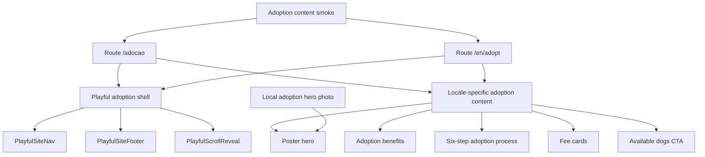

# feat: Redesign Adocao pages with Playful Impact

## Summary

Redesign the live `/adocao` adoption page directly with CAPA's Playful Impact system, preserving all current Portuguese adoption copy and strengthening the hero into a tactile rescue-poster first viewport.

Include `/en/adopt` parity in the same implementation so the language switcher does not send users from a polished Portuguese adoption page into a legacy English counterpart.

---

## Problem Frame

`/adocao` and `/en/adopt` already contain the right adoption guidance: responsible adoption framing, six benefits, a six-step adoption process, adoption fees, and the final available-dogs CTA. The current presentation still uses the older warm-earth gradient/card style, and the hero is a conventional text block without the Playful Impact hierarchy, photography, or tactile motion now established on the live home, help, about, and dog-listing routes.

The user wants the new design applied directly to the live adoption page, without a test page, without removing copy, and with special attention on making the hero much stronger.

---

## Requirements

**Route and copy preservation**

- R1. Redesign the existing live `/adocao` route directly; do not create a separate test or review page.
- R2. Preserve all current visible Portuguese copy, including hero text, benefits, process steps, fee cards, pricing, footnote, contact line, and final CTA.
- R3. Preserve `/en/adopt` copy and route behavior where parity is implemented, including translated hero text, benefits, process steps, fees, contact line, and final CTA.
- R4. Preserve practical paths: `/caes`, `/en/dogs`, `mailto:capa.geralpvl@gmail.com`, phone/footer links, and locale alternates.

**Playful Impact design**

- R5. Apply the Playful Impact system from `DESIGN.md`: cream canvas, Sora/Plus Jakarta Sans, juicy orange actions, peach/watermelon accents, real dog photography, pillowy cards, organic shapes, soft-brutalist rotations, and squishy interactions.
- R6. Rebuild the hero as a poster-like adoption promise with a dominant real dog photo, floating trust/fee/process badges, clear CTAs, and no white box behind the hero image.
- R7. Restyle the benefits, process, fee, and final CTA sections so they feel tactile and hand-placed rather than generic card grids.

**Accessibility, motion, and responsive behavior**

- R8. Maintain semantic landmarks, unique headings, meaningful image alt text in both locales, visible focus states, touch targets, and readable contrast.
- R9. Use the shared `PlayfulScrollReveal` motion system, respecting `prefers-reduced-motion` and preventing stuck-hidden content.
- R10. Keep mobile layouts single-column, overflow-safe, and readable around rotated cards, timeline markers, long price/card text, and CTA buttons.

**Operational safety**

- R11. Keep both adoption routes indexable; do not copy `noindex` behavior from `/test-landing`.
- R12. Keep Playful styling additive and route-scoped so unrelated live routes do not regress.
- R13. Build, preview, screenshot-check desktop/mobile, deploy to Hetzner, verify live `/adocao` and `/en/adopt`, and record the change in `CHANGELOG.md`.

---

## Key Technical Decisions

- **Direct live route, not a test page:** The user explicitly requested direct editing of `/adocao`, so the plan relies on local build, static content smoke, preview screenshots, and live verification before completion.
- **Bilingual parity in one pass:** `/en/adopt` shares the same adoption journey and language-switch surface, so parity avoids a polished Portuguese route sending users into a legacy English route.
- **Locale-aware static Astro components:** Use static components under `src/components/adocao/` with a small content map rather than keeping two long page files or introducing React for non-interactive content.
- **Shared Playful chrome and reveal:** Reuse `PlayfulSiteNav`, `PlayfulSiteFooter`, and `PlayfulScrollReveal` instead of duplicating the older `Nav`, `Footer`, or route-specific reveal scripts.
- **Local real-photo hero asset:** Create optimized WebP/JPEG hero assets under `public/images/adocao/` from existing CAPA dog photos or approved Playful hero material, keeping the image credible and text-free.
- **Content smoke before deploy:** Add an adoption-specific verifier for both built routes because copy preservation is the highest-risk part of a visual rewrite.

---

## High-Level Technical Design

---

## Scope Boundaries

### In scope

- Direct redesign of `/adocao`.
- `/en/adopt` parity using the same Playful adoption component system.
- Existing adoption copy, fee amounts, email links, and dogs-listing CTAs preserved.
- Local hero image derivatives, static smoke verification, screenshot QA, deploy, and live checks.

### Out of scope

- Rewriting adoption policy, fee amounts, or process copy.
- Changing dog listing/profile behavior or backend API behavior.
- Creating another noindex test route.
- Redesigning unrelated legacy pages beyond shared footer/nav consistency already in use.

### Deferred to Follow-Up Work

- Consolidating all older warm-earth page components after every public page has a Playful counterpart.
- Generating responsive image variants for every dog photo outside the adoption hero asset.
- Reworking the adoption form/process into a data-backed application flow.

---

## Implementation Units

### U1. Establish the Playful adoption route shell

- **Goal:** Move `/adocao` and `/en/adopt` onto the shared Playful shell while preserving their existing route paths and metadata behavior.
- **Requirements:** R1, R3, R4, R5, R8, R11, R12
- **Dependencies:** none
- **Files:**
  - `src/pages/adocao.astro`
  - `src/pages/en/adopt.astro`
  - `src/components/adocao/AdocaoPlayfulPage.astro`
  - `src/components/adocao/adocaoContent.ts`
  - `src/components/playful/PlayfulSiteNav.astro`
  - `src/components/playful/PlayfulSiteFooter.astro`
  - `src/components/playful/PlayfulScrollReveal.astro`
- **Approach:** Convert both route files into thin locale wrappers using `Layout` with `playfulFonts`, the shared Playful nav/footer, a `data-playful-scroll-reveal` page container, and a locale-aware `AdocaoPlayfulPage` component. Keep Open Graph URLs on `capapvl.org` and do not add `noindex`.
- **Patterns to follow:** `src/pages/sobre-nos.astro`, `src/pages/en/about.astro`, `src/pages/ajudar.astro`, `src/components/sobre-nos/SobreNosPlayfulPage.astro`
- **Test scenarios:**
  - Build `/adocao` and `/en/adopt`; both should render Playful chrome on their original routes.
  - Use the language switcher from `/adocao`; it should target `/en/adopt`, and switching back should target `/adocao`.
  - Inspect both built HTML files; neither should contain `noindex` or `capapvl.pt` Open Graph URLs.
  - Verify nav/footer links still target live public routes, including `/caes`, `/en/dogs`, `/ajudar`, and `/en/help`.
- **Verification:** Built adoption routes include the Playful shell, indexable metadata, and no legacy `Nav`/`Footer` page chrome.

### U2. Preserve adoption content in locale-aware data

- **Goal:** Make copy preservation explicit before restyling the page sections.
- **Requirements:** R2, R3, R4, R8
- **Dependencies:** U1
- **Files:**
  - `src/components/adocao/adocaoContent.ts`
  - `src/components/adocao/AdocaoPlayfulPage.astro`
  - `scripts/verify-adocao-content.mjs`
- **Approach:** Move the current Portuguese and English visible content into a typed content map for hero, six benefits, six process steps, three fee cards, contact line, and final CTA. Keep strings exact unless splitting a phrase into presentational spans is needed, and encode route-specific CTA links by locale.
- **Patterns to follow:** `src/components/sobre-nos/sobreNosContent.ts`, `src/components/caes/caesContent.ts`, `scripts/verify-about-content.mjs`, `scripts/verify-ajudar-content.mjs`
- **Test scenarios:**
  - Run the adoption content smoke against the built Portuguese route; every current hero, benefit, process, fee, contact, and CTA snippet should remain present.
  - Run the smoke against the built English route; every translated snippet should remain present.
  - Verify fee amounts remain `75€`, `65€`, and `30€`, with the puppy sterilization footnote intact.
  - Verify `mailto:capa.geralpvl@gmail.com`, `/caes`, and `/en/dogs` links remain present.
- **Verification:** `scripts/verify-adocao-content.mjs` passes for both built routes and forbids old `capapvl.pt` metadata or 404 text.

### U3. Build the stronger adoption hero

- **Goal:** Replace the legacy dark-gradient hero with a Playful first viewport that sells responsible adoption emotionally and visually.
- **Requirements:** R2, R3, R5, R6, R8, R9, R10, R11
- **Dependencies:** U1, U2
- **Files:**
  - `src/components/adocao/AdocaoPlayfulHero.astro`
  - `src/components/adocao/adocaoContent.ts`
  - `public/images/adocao/hero-playful-adoption.webp`
  - `public/images/adocao/hero-playful-adoption-fallback.jpg`
  - `src/pages/adocao.astro`
  - `src/pages/en/adopt.astro`
- **Approach:** Preserve the current badge, headline, two hero paragraphs, and adoption framing, but restage them with large Sora hierarchy, orange underline/sticker accents, primary CTA to available dogs, secondary CTA to the process section, and a dominant blob/circle hero photo. Add small floating badges for process, pricing, and responsible adoption proof without covering the dog face.
- **Patterns to follow:** `src/components/caes/CaesPlayfulHero.astro`, `src/components/sobre-nos/SobreNosPlayfulHero.astro`, `src/components/ajudar/AjudarPlayfulHero.astro`, `DESIGN.md`
- **Test scenarios:**
  - Verify hero strings remain visible in both locales, including `Adoção Responsável`, `Ganhe um Novo`, `Melhor Amigo!`, and the two paragraphs.
  - Verify the hero image loads locally with WebP and JPEG fallback, meaningful locale-aware alt text, `loading="eager"`, and `fetchpriority="high"`.
  - Capture desktop and mobile hero screenshots; the dog face should remain visible and floating badges should not overlap headline or CTA text.
  - With reduced motion enabled, the hero should render without hidden or delayed critical content.
- **Verification:** The first viewport reads like a Playful adoption poster rather than the previous gradient information header.

### U4. Redesign benefits, process, fees, and CTA sections

- **Goal:** Restyle the full adoption journey while keeping the existing informational sequence and conversion paths.
- **Requirements:** R2, R3, R4, R5, R7, R8, R9, R10
- **Dependencies:** U1, U2
- **Files:**
  - `src/components/adocao/AdocaoBenefits.astro`
  - `src/components/adocao/AdocaoProcess.astro`
  - `src/components/adocao/AdocaoFees.astro`
  - `src/components/adocao/AdocaoFinalCta.astro`
  - `src/components/adocao/AdocaoPlayfulPage.astro`
- **Approach:** Render benefits as tactile cards with icon bubbles and small rotations; render the six-step process as a readable Playful timeline/card sequence; render fees as three clear price cards with included care lists; render the final CTA as a high-contrast Playful close linking to the correct dogs listing by locale. Use `data-reveal` and `data-reveal-stagger` on grouped content.
- **Patterns to follow:** `src/components/sobre-nos/SobreNosPrinciples.astro`, `src/components/ajudar/AjudarFinancialDonations.astro`, `src/components/test-landing/PlayfulHelpCta.astro`, current `src/pages/adocao.astro` and `src/pages/en/adopt.astro`
- **Test scenarios:**
  - Verify all six benefit titles and descriptions remain present in both locales.
  - Verify all six process step titles and descriptions remain present in order in both locales.
  - Verify the three fee cards keep titles, prices, included-care bullets, and puppy footnote in both locales.
  - At 320px and 390px widths, verify cards and timeline markers do not create horizontal overflow.
  - Scroll through the full page; all reveal-marked elements should become visible by the page bottom.
- **Verification:** The page keeps the adoption journey intact while matching the Playful rhythm, spacing, and motion used across the redesigned site.

### U5. Verify, deploy, and document the adoption redesign

- **Goal:** Prove the direct live redesign is safe, publish it, and document the change.
- **Requirements:** R1, R2, R3, R9, R10, R11, R12, R13
- **Dependencies:** U1, U2, U3, U4
- **Files:**
  - `scripts/verify-adocao-content.mjs`
  - `CHANGELOG.md`
  - `docs/plans/2026-06-22-001-feat-adocao-playful-impact-redesign-plan.md`
- **Approach:** Add static smoke coverage, build with the production API URL and fresh asset version, preview locally, capture desktop/mobile screenshots for `/adocao` and at least one `/en/adopt` viewport, verify no stuck reveals or horizontal overflow, deploy the built `dist/` to the Hetzner nginx root, and run live HTTP/static/browser checks.
- **Patterns to follow:** `scripts/verify-about-content.mjs`, `scripts/verify-ajudar-content.mjs`, CAPA deploy guidance in `AGENTS.md`, recent Playful page changelog entries.
- **Test scenarios:**
  - Static smoke passes for both adoption routes after production build.
  - Local preview returns 200 for `/adocao/` and `/en/adopt/` with Playful root markup and no `noindex`.
  - Desktop/mobile screenshot QA shows no clipped hero, unreadable fee cards, horizontal overflow, or stuck reveal elements.
  - Live post-deploy checks confirm `/adocao/` and `/en/adopt/` return 200, include the Maps footer link, keep the adoption copy, and reference the new local hero asset.
- **Verification:** Production is deployed from source, live routes are checked with real HTTP/browser output, and the repo is committed and pushed.

---

## Risks & Dependencies

- **Copy preservation risk:** The current page is long and inline; the content smoke script must cover representative strings from every section in both locales.
- **Hero crop risk:** Existing dog photos vary in framing; choose and crop the hero so the dog face remains visible on desktop and mobile before deploying.
- **Motion risk:** Reveal wrappers can leave content invisible if JS fails; rely on the shared Playful reveal component and check reduced-motion/stuck-hidden behavior.
- **Legacy parity risk:** Editing only `/adocao` would create an inconsistent language-switch experience; this plan includes `/en/adopt` to avoid that.

---

## Documentation / Operational Notes

- Update `CHANGELOG.md` with the adoption redesign, parity scope, content smoke, and deployment verification.
- Keep `DESIGN.md` unchanged unless implementation discovers a reusable adoption-specific design rule that should become canonical.
- Deploy from the built `dist/` output only; never edit files directly under the live nginx root.

---

## Sources / Research

- `DESIGN.md` defines Playful Impact non-negotiables, hero guidance, palette, typography, shape, and motion rules.
- `src/pages/adocao.astro` and `src/pages/en/adopt.astro` are the source of truth for current adoption copy.
- `src/pages/ajudar.astro`, `src/pages/sobre-nos.astro`, and `src/pages/caes.astro` show the current Playful shell pattern.
- `src/components/ajudar/*`, `src/components/sobre-nos/*`, and `src/components/caes/*` provide the section and hero patterns to reuse.
- `scripts/verify-ajudar-content.mjs` and `scripts/verify-about-content.mjs` provide the static smoke pattern.
