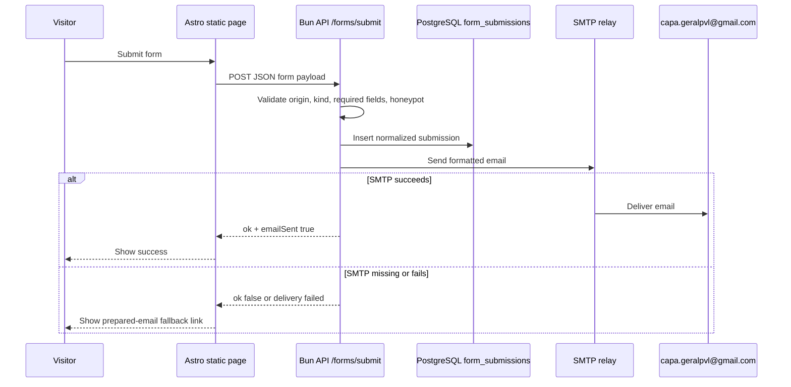

# feat: Add backend form submissions

## Summary

Add a real form-submission path through the existing Hetzner Bun API so CAPA’s visitor forms no longer depend on `mailto:` as the primary delivery mechanism. The backend stores each valid submission in PostgreSQL, attempts email delivery to `capa.geralpvl@gmail.com`, and returns enough status for the static frontend to show success or fall back to the existing prepared-email link.

---

## Problem Frame

The public Astro site is static, so it cannot host an Astro server endpoint. The live architecture already includes `https://api.capapvl.org` proxying to `server/capa-api.ts`, which is the correct backend surface for public form submissions. Current data-collection forms prepare `mailto:` links, which can fail silently when visitors have no local mail app.

---

## Requirements

**Backend delivery**

- R1. The existing Bun API exposes a public form-submission endpoint for browser clients from allowed CAPA origins.
- R2. The endpoint accepts only known form kinds: sponsorship, MB Way phone request, shelter/dog visit request, and adoption interest.
- R3. Valid submissions are persisted in PostgreSQL before email delivery is attempted so requests are not lost if SMTP fails.
- R4. Email delivery targets `capa.geralpvl@gmail.com` through server-only SMTP configuration, with no SMTP secrets exposed to the static frontend.
- R5. If email delivery is unavailable or fails, the endpoint returns a non-success delivery state that lets the frontend preserve the current `mailto:` fallback.

**Frontend integration**

- R6. Existing sponsor, MB Way, and visit forms submit to the backend first and show a clear success state when the backend accepts and emails the request.
- R7. Dog adoption interest is converted from a plain `mailto:` CTA into the same backend-backed form flow while preserving dog context.
- R8. Existing prepared-email links remain available as fallback and for QA, but they are no longer the primary path on successful backend delivery.
- R9. PT and EN pages keep localized labels, feedback messages, and email body content.

**Verification and operations**

- R10. Browser smokes cover successful backend submission and fallback behavior without launching a real email client.
- R11. API smokes cover validation failure, honeypot rejection, persistence, and configured/unconfigured delivery states.
- R12. Deployment updates `/etc/capapvl-api.env` documentation for required SMTP variables and restarts `capapvl-api.service` without widening the loopback bind.

---

## Key Technical Decisions

- **Use `server/capa-api.ts`, not Astro routes:** The site deploys as static files under nginx, while the Bun API is already live at `api.capapvl.org` and has CORS/origin handling.
- **Persist then email:** Storing submissions first prevents total data loss when SMTP is down and gives operators a recovery path.
- **Keep `mailto:` as fallback:** The backend cannot prove delivery without SMTP credentials, and mail providers can fail. The current prepared-email UX remains the safe fallback path.
- **Use server-only SMTP env:** Mail transport belongs in `/etc/capapvl-api.env`; no frontend `PUBLIC_` variables should contain mail credentials.
- **Allowlist form kinds and fields:** A generic free-form email relay would be an abuse vector. The endpoint should validate kind-specific required fields, trim strings, cap lengths, and ignore unknown payload fields.
- **Include a honeypot field:** Public unauthenticated forms need low-friction bot resistance before adding heavier CAPTCHA.

---

## High-Level Technical Design

---

## Scope Boundaries

### In scope

- Backend endpoint, persistence table, SMTP delivery wiring, and CORS-safe public submission handling.
- Current form surfaces that collect visitor information: sponsor modal, MB Way modal, visit scheduling forms, and dog adoption interest.
- Verification scripts and deployment docs needed to prove the path.

### Deferred to Follow-Up Work

- CAPTCHA or Turnstile if spam appears after launch.
- Admin UI for browsing stored form submissions.
- Background retry queue for failed email delivery.
- Replacing every plain “contact us” mailto link with a modal form; those links are not current structured submission forms.

---

## Implementation Units

### U1. Backend form endpoint and persistence

- **Goal:** Add `/forms/submit` to the existing Bun API, validate public payloads, persist accepted submissions, and return structured delivery status.
- **Requirements:** R1, R2, R3, R5, R11
- **Dependencies:** none
- **Files:**
  - `server/capa-api.ts`
  - `scripts/verify-form-endpoint.mjs`
  - `.env.example`
- **Approach:** Add a `form_submissions` table bootstrap guarded by `create table if not exists`. Normalize payloads into a consistent shape with kind, locale, page URL, context label/value, visitor fields, message, and metadata. Reject unknown kinds, missing required fields, oversized fields, invalid email format, and filled honeypot fields. Return JSON with submission ID and delivery state.
- **Patterns to follow:** Existing `json`, `error`, `corsHeaders`, request routing, and PostgreSQL `pool.query` patterns in `server/capa-api.ts`.
- **Test scenarios:**
  - Submit a valid visit payload with SMTP disabled; expect the row to persist and the response to indicate email delivery is not configured.
  - Submit an unknown kind; expect `400` and no row.
  - Submit missing required name/email fields; expect `400` and no row.
  - Submit a filled honeypot field; expect a bot-safe response that does not send email.
  - Submit from an allowed origin; expect CORS headers to echo the allowed origin.
- **Verification:** The API smoke can run against a local API process and prove validation and persistence behavior without real email credentials.

### U2. SMTP email delivery

- **Goal:** Add server-only SMTP delivery for persisted submissions.
- **Requirements:** R4, R5, R12
- **Dependencies:** U1
- **Files:**
  - `server/capa-api.ts`
  - `package.json`
  - `bun.lock`
  - `.env.example`
  - `AGENTS.md`
- **Approach:** Use a Node-compatible SMTP mailer dependency from the Bun API. Configure host, port, security mode, username, password, from address, and recipient through `/etc/capapvl-api.env`. Format subject/body from the normalized server-side payload rather than trusting client-provided email text. If SMTP is not configured or delivery throws, keep the DB row and return a delivery-failed state.
- **Patterns to follow:** Server-only env guidance in `AGENTS.md`; dependency management through Bun.
- **Test scenarios:**
  - With SMTP env absent, valid submission persists and returns a configured-false delivery state.
  - With a test SMTP transport or dry-run mode enabled, valid submission returns email-sent success without contacting a real provider.
  - Delivery failure keeps the persisted row and returns a fallback-safe delivery state.
- **Verification:** Local endpoint smokes prove dry-run success and unconfigured fallback; live verification can prove true email only after SMTP credentials are installed.

### U3. Shared frontend submission helper

- **Goal:** Give React and inline Astro scripts a single API contract for backend-first submit with `mailto:` fallback.
- **Requirements:** R6, R8, R9, R10
- **Dependencies:** U1
- **Files:**
  - `src/lib/formSubmission.ts`
  - `src/components/VisitSchedule.tsx`
  - `src/i18n/pt.ts`
  - `src/i18n/en.ts`
  - `scripts/verify-dog-profile-browser.mjs`
- **Approach:** Add a small helper that posts to `${PUBLIC_CAPA_API_URL}/forms/submit`, handles API/network errors, and returns `sent`, `fallback`, or `error` status. Update the visit form to call the helper before exposing the prepared email link. Keep QA hooks that skip real email-client launches.
- **Patterns to follow:** Existing `src/lib/capaApi.ts` API base URL handling and the current `VisitSchedule.tsx` mailto construction.
- **Test scenarios:**
  - Backend returns email-sent success; visit modal shows success and does not focus the fallback link.
  - Backend returns delivery failed; visit modal shows fallback link with the prepared email.
  - Network failure; visit modal shows fallback link.
  - Dog visit payload includes dog name; footer visit payload includes shelter context.
- **Verification:** Dog-profile browser verifier proves both dog and footer visit submissions hit the backend contract and preserve fallback.

### U4. Sponsor and MB Way form integration

- **Goal:** Convert the existing sponsor and MB Way modals from mailto-first to backend-first submission.
- **Requirements:** R6, R8, R9, R10
- **Dependencies:** U1, U3
- **Files:**
  - `src/components/test-landing/PlayfulHelpCta.astro`
  - `src/components/playful/PlayfulDonateMenu.astro`
  - `scripts/verify-live-landing-browser.mjs`
  - `scripts/verify-live-landing-content.mjs`
- **Approach:** Add inline browser helper logic compatible with Astro scripts or expose a tiny global helper from the shared module if the build pattern supports it. Preserve the current prepared mailto body, but try the backend first and show success/fallback messaging based on the response.
- **Patterns to follow:** Existing modal open/close and `data-sponsor-*` / `data-mbway-*` QA hooks.
- **Test scenarios:**
  - Sponsor modal backend success shows a success state and preserves the fallback link as secondary.
  - Sponsor modal backend failure shows the existing prepared-email fallback.
  - MB Way backend success includes the phone number and page URL in the submission payload.
  - MB Way validation still requires a phone number before submission.
- **Verification:** Landing browser smoke proves sponsor and MB Way submit paths call the backend contract and retain fallback behavior.

### U5. Adoption interest form

- **Goal:** Replace the dog-profile adoption `mailto:` CTA with a structured backend-backed adoption interest form.
- **Requirements:** R2, R6, R7, R8, R9, R10
- **Dependencies:** U1, U3
- **Files:**
  - `src/components/DogProfile.tsx`
  - `src/components/VisitSchedule.tsx` or a new shared contact form component if reuse is clearer
  - `src/i18n/pt.ts`
  - `src/i18n/en.ts`
  - `scripts/verify-dog-profile-browser.mjs`
- **Approach:** Keep the existing adoption CTA placement, but open a small modal asking for name, email, phone, and message with dog context. Submit through `/forms/submit` with kind `adoption_interest` and keep a prepared-email fallback.
- **Patterns to follow:** Visit modal component style, focus behavior, safe-area modal layout, and dog-context mail body.
- **Test scenarios:**
  - Available dog profile opens the adoption interest modal and submits dog name plus visitor details.
  - Adopted dog profile still does not show adoption/visit conversion CTAs.
  - Backend failure exposes a prepared email link.
  - EN and PT labels match the active locale.
- **Verification:** Dog-profile browser smoke covers adoption interest submission for available dogs and absence for adopted dogs.

### U6. Deployment and live verification

- **Goal:** Deploy the API and static frontend safely, then verify backend and browser behavior live.
- **Requirements:** R10, R11, R12
- **Dependencies:** U1, U2, U3, U4, U5
- **Files:**
  - `CHANGELOG.md`
  - `AGENTS.md`
- **Approach:** Build the static site with a fresh asset version, sync `dist/`, restart `capapvl-api.service`, and verify `https://api.capapvl.org/health`, `/forms/submit` validation, and browser flows. If SMTP credentials are not installed, live verification must report backend persistence/fallback only and mark true email delivery blocked by env.
- **Patterns to follow:** Current deployment and permission flow in `AGENTS.md`.
- **Test scenarios:**
  - Live health endpoint returns `200` after service restart.
  - Live invalid form payload returns `400` with CORS headers.
  - Live frontend still returns `200` for PT/EN homepage and dog pages.
  - Browser QA proves success/fallback UI does not regress mobile layout.
- **Verification:** Live command output shows endpoint responses, browser smokes pass, production permissions remain `755` for directories and `644` for files, and git `HEAD` matches `origin/main`.

---

## Risks & Dependencies

- **SMTP credentials are required for true email delivery.** The current live service has no SMTP/env mail transport. Code can be deployed and fallback verified, but a real email-to-CAPA proof requires adding server-only SMTP variables to `/etc/capapvl-api.env`.
- **Public endpoint abuse risk.** Validation, field caps, honeypot, and optional future CAPTCHA mitigate the first launch; rate limiting can be added if spam appears.
- **Static frontend cache.** React island behavior changes require a fresh `CAPA_ASSET_VERSION` so immutable `/_astro/*` assets update for visitors.

---

## Sources & Research

- `AGENTS.md` defines the live architecture: static Astro site at `/home/deploy/apps/capapvl` plus Bun API at `server/capa-api.ts` proxied via `https://api.capapvl.org`.
- `server/capa-api.ts` already contains CORS, auth, PostgreSQL, and public GET route patterns to follow.
- `src/components/VisitSchedule.tsx`, `src/components/test-landing/PlayfulHelpCta.astro`, and `src/components/playful/PlayfulDonateMenu.astro` are the current structured submission surfaces.
- System inspection found no local `sendmail`, `msmtp`, `mail`, or SMTP env keys; outbound port 587 is reachable.
